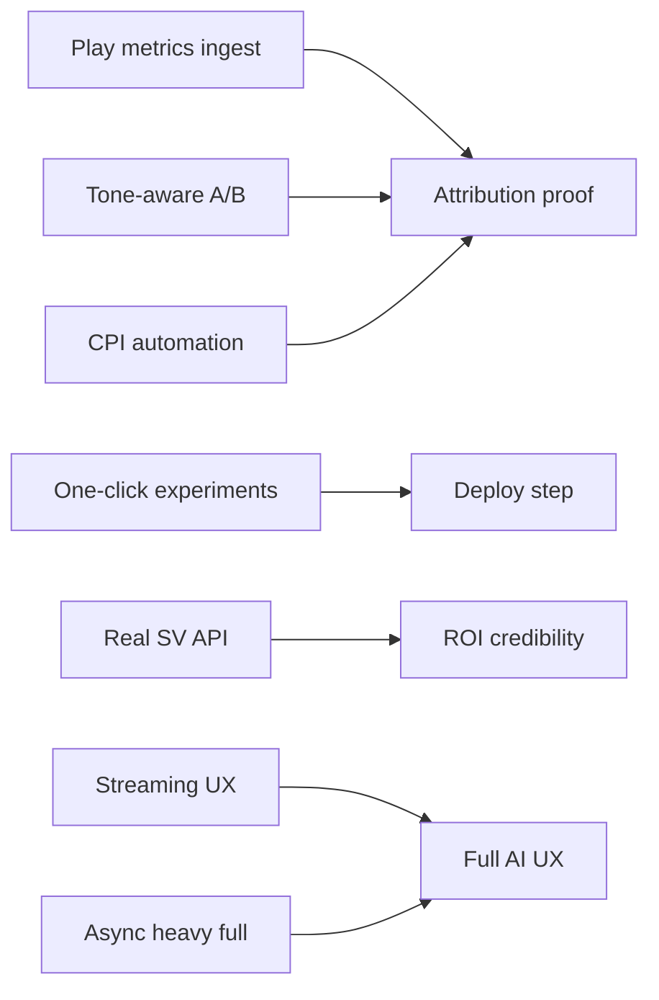

# playstore.xyz — Progress Updates

**Living tracker** for gaps blocking the full ASO loop and prioritized next work.  
Update this file **at the end of each session** when a gap is closed or priorities shift.

**Related (source of truth for architecture):** [`PROJECT_STATUS.md`](./PROJECT_STATUS.md) · [`IMPLEMENTATION_STATUS.md`](./IMPLEMENTATION_STATUS.md) · [`STAGING_VAULT_INTEGRATION_SUMMARY.md`](./STAGING_VAULT_INTEGRATION_SUMMARY.md)

**Last updated:** 2026-07-07 (Session — P1 #1: CPI field in Growth Tracking)

---

## How to use this file

1. **Start each session** — read **Gaps Blocking Full Loop** and **What to Work on Next**.
2. **Pick the top open P0 gap** (or the first 🟡 in-progress item).
3. **When a gap closes** — change status to 🟢, add a line under **Session log**, and move the next item up.
4. **Do not duplicate** full architecture here; link to `PROJECT_STATUS.md` / `IMPLEMENTATION_STATUS.md` for deep detail.

---

## Current phase

| Item | Value |
|------|--------|
| Phase | Production — Active Development |
| Branch | `feature/hardened-listing-pipeline` |
| Positioning | B2B Performance Analyst: vault → ROI intelligence → deploy → attribution |
| Closed loop status | **Partial** — tone A/B + async heavy-vault routing shipped; **prod GCS credentials still required** for live attribution metrics |

---

## Gaps blocking full loop

The full loop is: **Research → Curate → Synthesize → Deploy → Attribute → Prove ROI**.

| # | Gap | Status | What's missing | Unblocks |
|---|-----|--------|----------------|----------|
| G1 | **Play Console metrics ingest (prod)** | 🟡 Partial | Code + cron + readiness API ✅. **Ops:** set `GOOGLE_PLAY_SERVICE_ACCOUNT_JSON`, `GOOGLE_PLAY_DEVELOPER_ACCOUNT_ID`, `CRON_SECRET` on Vercel prod; trigger cron | Performance Attribution CVR/CTR deltas |
| G2 | **CPI / paid acquisition loop** | 🟡 Partial | `cost_per_install` on `listing_metrics` + weekly form + attribution deltas ✅. Google Ads / UAC API still manual entry | Closed-loop ROI for paid traffic |
| G3 | **Real keyword search volume** | 🔴 Open | ROI panel uses heuristics unless Keyword Tracker has data; no AppTweak / data.ai partner | Enterprise credibility for `keywordIntelligence` |
| G4 | **Tone-aware A/B attribution** | 🟢 Complete | Dynamic arms from `toneStyle`; `toneApplied` per version | Compare Friendly vs Minimal (any tone pair) |
| G5 | **Play Listing Experiments — one-click deploy** | 🟡 Partial | Tone A/B plan + dynamic arms + export copy ✅; user still **manually pastes** into Play Console | Zero-copy experiment launch |
| G6 | **i18n dashboard parity (analyst UI)** | 🟡 Partial | Main nav + Performance Attribution i18n ✅; analyst cards still EN-inline | MENA moat |
| G7 | **Streaming / progressive LLM UX** | 🔴 Open | Sync full unlock 2–3 min with spinner only; no SSE / phase reveal | Perceived latency on Full AI |
| G8 | **MAX_TOKENS on heavy vault** | 🟡 Partial | Mitigations ✅ + **async routing for heavy full unlock** ✅ (`full-unlock-async-policy.ts`). Prod load test (10×) still pending | Reliable Full AI at scale |

### Gap dependency chain



**Critical path to “closed loop”:** G1 (ops env) → G2 → attribution proves ROI.

---

## What to work on next (priority order)

### P0 — Before next user-facing release

| Done | Task | Gap | Notes |
|------|------|-----|-------|
| ✅ | Mount Performance Attribution tab | — | 2026-07-02 |
| ✅ | Sync full unlock timeout + recovery (330s) | G7 partial | 2026-07-07 |
| ✅ | B2B Performance Analyst + ROI intelligence | — | 2026-07-06 |
| ✅ | Tone-aware A/B arms + attribution `toneApplied` | G4 | 2026-07-07 |
| ✅ | **Async routing for heavy `generationStep: full`** | G8 partial | 2026-07-07 — `shouldPreferAsyncFullUnlock()` in generate route |
| ✅ | **Validate `uiFocus` from Gemini** | — | 2026-07-07 — 19 tests pass; `uiFocus` in schema `required` |
| 🟡 | **Production Play metrics ingest** | G1 | Readiness in `GET /performance-attribution` → `ingestReadiness`. **You:** set Vercel env + run cron |
| 🟡 | **Validate MAX_TOKENS under production load** | G8 | Code routes heavy vaults to async. **You:** run 10× full unlock in prod; set `LISTING_FULL_FORCE_ASYNC=1` if >20% truncate |

#### G1 ops checklist (manual — blocks attribution data)

```bash
# 1. Vercel → Project → Settings → Environment Variables (Production)
GOOGLE_PLAY_SERVICE_ACCOUNT_JSON=<full JSON or base64>
GOOGLE_PLAY_DEVELOPER_ACCOUNT_ID=<numeric developer ID>
CRON_SECRET=<random secret>

# 2. After deploy, trigger ingest
curl -X POST https://playstore.xyz/api/cron/ingest-play-metrics \
  -H "Authorization: Bearer $CRON_SECRET"

# 3. Verify — open Performance Attribution; response includes ingestReadiness.ready: true
#    and versionsWithMetrics > 0 after apps have deployed versions
```

#### G8 env overrides

| Variable | Effect |
|----------|--------|
| `LISTING_FULL_FORCE_ASYNC=1` | Always async for full unlock |
| `LISTING_FULL_SYNC_ALLOW=1` | Never async (dev/debug) |

Heavy-context triggers (auto async): vault items ≥20, client queue ≥18, tracked keywords ≥8, active context labels ≥24.

---

### P1 — Core UX gaps

| Done | Task | Gap |
|------|------|-----|
| ⬜ | i18n audit — Session 8 components → `messages/ar.json` | G6 |
| ✅ | CPI field in Growth Tracking (`cost_per_install` on weekly form) | G2 |
| ⬜ | Deployment View — Play Store publish E2E (live service account) | G5 |
| ⬜ | Keyword rank history chart (`keyword_rank_snapshots`) | — |

### P2 — Market uplift (one per sprint)

| Done | Task | Gap |
|------|------|-----|
| ⬜ | Search volume data partner → `enrichKeywordIntelligence` | G3 |
| ⬜ | Auto queue from Competitor Spy gaps | — |
| ⬜ | Weekly ASO digest email | — |
| ⬜ | Localized listings UI (ae/in/mx) | — |
| ⬜ | A/B snapshot UI under Growth hub | G5 |

### P3 — Technical debt

| Done | Task |
|------|------|
| ⬜ | Remove `src/debug-token.ts`, `src/test-ingestion.ts`, `PGRST116_FINAL_FIX.ts` |
| ⬜ | Delete or fix `StagingButtonTestHarness.tsx` |
| ⬜ | Consolidate `lib/` → `src/lib/`, `components/` → `src/components/` |
| ⬜ | Gate verbose `[DEBUG]` logs in `generate/route.ts` |
| ⬜ | Producer registry stubs — implement or delete |

---

## Recommended next session

1. **G1 ops** — Configure Vercel env vars and run cron (highest impact; no more code needed).
2. **G8 prod smoke** — 10 full unlocks on a gap-heavy workspace; confirm async `202` when vault is heavy.
3. **P1: i18n audit** — Session 8 components → `messages/ar.json` (G6).

---

## Session log

| Date | Completed | Gaps closed / moved |
|------|-----------|---------------------|
| 2026-07-07 | **P1 #1:** CPI field — `cost_per_install` migration, metrics POST/GET, attribution `cpiDelta` + verdict, Growth Tracking form + delta UI (EN/AR) | G2 → 🟡 |
| 2026-07-07 | **P0 code:** `full-unlock-async-policy.ts` — heavy vault → async full unlock; `play-metrics-ingest-readiness.ts` on attribution API; uiFocus tests validated (19 pass) | G8 → 🟡, G1 → 🟡 |
| 2026-07-07 | Tone-aware A/B: dynamic arms from `toneStyle`, `toneExperiment`, `toneApplied` | G4 → 🟢 |
| 2026-07-07 | Sync timeout 330s + hydration recovery; MAX_TOKENS mitigation | G7 partial |
| 2026-07-06 | B2B Performance Analyst, ROI `keywordIntelligence`, tone A/B deploy plan | — |
| 2026-07-02 | Performance Attribution page mounted | — |

### P0 files added this session

```
src/lib/listing/full-unlock-async-policy.ts
src/lib/performance/play-metrics-ingest-readiness.ts
tests/full-unlock-async-policy.test.ts
app/api/listings/generate/route.ts          — async when heavy full unlock
app/api/workspaces/.../performance-attribution/route.ts — ingestReadiness
```

---

## Open bugs (quick reference)

| Priority | Issue | Tied gap |
|----------|-------|----------|
| P0 | Empty attribution metrics in prod | G1 — **ops env** |
| P0 | `MAX_TOKENS` on heavy vault | G8 — async policy shipped; prod load test pending |
| P1 | 2–3 min sync unlock UX | G7 |
| P1 | Heuristic search volume | G3 |
| P2 | i18n gaps in analyst UI | G6 |

---

*Update the **Last updated** line and **Session log** every time you close a gap or shift priorities.*
